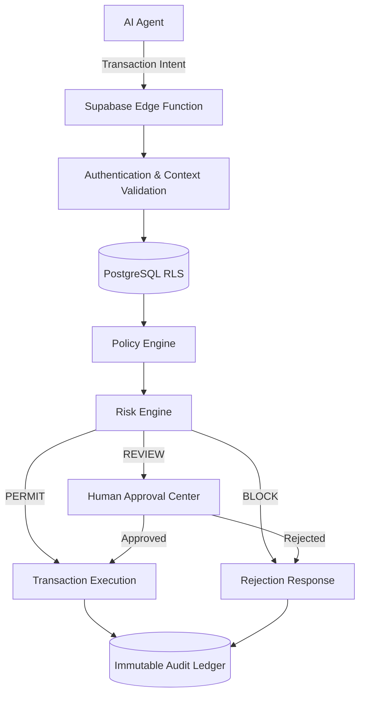

# Guardrail Core

Guardrail Core is an enterprise-grade AI governance and financial control plane. It acts as an immutable trust layer between autonomous AI agents and core financial systems, ensuring all automated transactions are securely authorized, dynamically risk-evaluated, and cryptographically audited.

**Secure • Intelligent • Compliant**

---

## 🚀 Overview

As autonomous AI agents increasingly execute transactions and make financial decisions, organizations require strict boundaries to prevent unauthorized actions, double-spending, and policy violations. Guardrail Core provides a multi-tenant, real-time transaction execution engine that sits between AI actors and your infrastructure. 

Designed for platform operators and enterprise merchants, Guardrail Core provides dynamic risk assessment, strict policy enforcement, human-in-the-loop approval workflows, and an immutable cryptographic ledger for all agent activities.

## 🎯 Problem

The rise of AI-driven commerce introduces unprecedented risks:
- **Unbounded Agent Authority:** AI agents require strict scoping to prevent accidental or malicious financial operations.
- **Tenant Data Leakage:** Multi-tenant systems require strict isolation to ensure agents cannot cross merchant boundaries.
- **Lack of Human Oversight:** High-risk transactions require deterministic human review before execution.
- **Auditability:** AI actions must be cryptographically recorded in a tamper-proof ledger for compliance and forensic analysis.

## 💡 Solution

Guardrail Core solves these challenges by routing all AI agent actions through a strictly governed Edge Function execution pipeline:
1. **Context Validation:** Every request is authenticated and strictly scoped to a specific tenant boundary using Row Level Security (RLS).
2. **Policy Enforcement:** Transactions are evaluated against strict merchant-defined policies and agent authority limits.
3. **Risk Evaluation:** Real-time risk heuristics determine whether to `PERMIT`, `BLOCK`, or escalate to `REVIEW`.
4. **Human-in-the-Loop:** High-risk actions are paused and routed to the Approval Center for human authorization.
5. **Immutable Ledger:** Every decision, intent, and execution is permanently written to a tamper-proof cryptographic audit ledger.

## 🏗️ Architecture

Guardrail Core is built on a modern, serverless stack designed for high performance and strict isolation.



- **Frontend:** React + Vite + TypeScript, styled with Tailwind CSS, Framer Motion, and Three.js.
- **Backend / Database:** Supabase (PostgreSQL) with strict Row Level Security (RLS).
- **Compute:** Deno-based Supabase Edge Functions (`guardrail-engine` and `provision-sandbox`).
- **Access Control:** Postgres RPCs with `SECURITY DEFINER` constraints.

## ✨ Key Features

- **Merchant/Sandbox Provisioning:** Fully automated provisioning of isolated sandbox environments for multi-tenant testing.
- **Operator Access & Account Switching:** Global platform operators can securely switch contexts between isolated merchant environments.
- **Policy Studio:** Define explicit rules, boundaries, and financial limits for AI agents.
- **Approval Center:** A dedicated human-in-the-loop workflow for reviewing and authorizing escalated transactions.
- **Live Transaction Simulator:** Inject synthetic transaction intents to test agent boundaries and risk models in real-time.
- **Guardrail Engine:** High-performance Deno Edge Function evaluating transactions for PERMIT/BLOCK/REVIEW outcomes.
- **Immutable Ledger:** Cryptographically signed, append-only audit trail preventing `UPDATE` or `DELETE` anomalies.
- **Revenue Intelligence & System Health:** Interactive dashboards tracking transaction throughput, block rates, and system idempotency.
- **Failure Lab:** Purpose-built UI for simulating adversarial conditions, privilege escalations, and isolation breaches.

## 🔐 Security & Governance

Security is enforced at the database kernel level:
- **Strict Tenant Isolation:** All operations enforce `merchant_id` context via Postgres triggers and `auth.uid()`.
- **Row Level Security (RLS):** Policies explicitly prevent cross-tenant data leakage.
- **Idempotency:** Cryptographic hashing prevents replay attacks and double-spend scenarios.
- **Audit Immutability:** Postgres triggers strictly `REJECT` any `DELETE` or `UPDATE` statements against the `audit_events` table.
- **Privilege Control:** Strict Role-Based Access Control (RBAC) ensuring agents cannot modify their own policies.

## 🧠 Guardrail Decision Flow

When a transaction intent is received by the `guardrail-engine`:
1. **Auth Sync:** Verifies the JWT and resolves the isolated `merchant_id`.
2. **Intent Parsing:** Analyzes the requested action, payload, and monetary value.
3. **Policy Evaluation:** Checks the intent against the active Policy Version and Agent Authority limits.
4. **Decisioning:** Returns a deterministic outcome:
   - `PERMIT`: Executed immediately and recorded.
   - `BLOCK`: Rejected immediately due to policy violation.
   - `REVIEW`: Escalate to the `human_reviews` pipeline.

## 🖥️ Product / Dashboard

The Guardrail Core frontend is a responsive, highly technical control plane featuring:
- **System View:** Real-time metrics, node visualizations (Three.js), and system health.
- **Transactions Explorer:** Deep dive into execution paths, JSON payloads, and risk metadata.
- **Policy & Risk Views:** Configure thresholds and view active enforcement rules.
- **Approval Center:** Unified interface for supervisors to clear or reject pending transactions.

## 🧪 Testing & QA

Guardrail Core includes a comprehensive live adversarial QA harness designed to run against the production database:

- `qa-live-harness.ts`: An end-to-end test suite validating tenant isolation, privilege escalation, immutable audit logging, and Edge Function routing.
- `test-provision.js`: Validates automated sandbox creation.
- `test-rpc.js`: Validates `SECURITY DEFINER` execution constraints.

**Run the QA Harness:**
```bash
bun run qa-live-harness.ts
```

## ⚙️ Tech Stack

| Category | Technology |
|----------|------------|
| Frontend | React 19, TypeScript, Vite |
| Styling | Tailwind CSS v4, Framer Motion, Lucide React |
| 3D Rendering | Three.js |
| Backend & Auth | Supabase |
| Database | PostgreSQL (with RLS) |
| Edge Computing | Deno (Supabase Edge Functions) |
| Testing/Execution | Bun / Node.js |

## 📦 Project Structure

```text
guardrail-core/
├── src/
│   ├── components/    # Reusable UI elements, Modals, Drawers
│   ├── context/       # Auth and Global State management
│   ├── hero/          # 3D visualizations and landing page assets
│   ├── utils/         # Supabase client and formatters
│   └── main.tsx       # Application entry point
├── supabase/
│   ├── functions/     # Deno Edge Functions (guardrail-engine, provision-sandbox)
│   └── migrations/    # Ordered PostgreSQL schema, RLS, and RPC definitions
├── qa-live-harness.ts # Adversarial E2E testing suite
└── package.json       # Project dependencies and scripts
```

## 🛠️ Local Setup

### 1. Clone the repository
```bash
git clone <repository-url>
cd guardrail-core000
```

### 2. Install dependencies
```bash
bun install
```

### 3. Setup Supabase (Local Development)
Ensure you have Docker installed and running, then install the Supabase CLI:
```bash
npx supabase start
```
*This spins up a local PostgreSQL instance, applies all migrations in `/supabase/migrations`, and starts the Edge Functions.*

### 4. Environment Variables
Copy `.env.example` to `.env` (or create a `.env` file) and provide the local Supabase credentials generated by `supabase start`:
```env
VITE_SUPABASE_URL=http://127.0.0.1:54321
VITE_SUPABASE_ANON_KEY=eyJhbG...
```

### 5. Start the Frontend
```bash
bun run dev
```
Navigate to `http://localhost:3000` to access the login gateway.

## 🔑 Environment Variables

| Variable | Purpose | Required |
|----------|---------|----------|
| `VITE_SUPABASE_URL` | Application endpoint for Supabase backend | Yes |
| `VITE_SUPABASE_ANON_KEY` | Public anonymous key for Supabase client | Yes |

## ▶️ Running the Project

### Start Backend / Infrastructure
```bash
npx supabase start
```

### Start Frontend
```bash
bun run dev
```

### Run Tests
```bash
bun run qa-live-harness.ts
```

## 🧪 Demo / Judge Walkthrough

1. **Access the Gateway:** Open `http://localhost:3000`. You will see the 3D Authentication Kernel landing page.
2. **Provision a Sandbox:** Click **SANDBOX PROVISION**. Enter an email (e.g., `demo@guardrail.com`), a company name, and a password to instantly provision an isolated tenant environment.
3. **Operator Dashboard:** Once provisioned, login using the credentials. You will enter the main System View.
4. **Live Simulation:** Open the **Command Palette** (bottom left corner or via `Ctrl+K` if bound) and trigger the **Live Transaction Simulator**.
5. **Watch the Engine:** Submit a transaction. The `guardrail-engine` Edge Function will evaluate it in real-time. Watch the intent either `PERMIT`, `BLOCK` (based on limits), or hit `REVIEW`.
6. **Approval Center:** If a transaction hits `REVIEW`, navigate to the **Approvals** view to manually accept or reject the action.
7. **Audit Ledger:** Navigate to the **Audit** view to see the cryptographically immutable ledger of all actions.

## 🏆 Why Guardrail Core

Guardrail Core stands out because it doesn't just monitor AI—it fundamentally restricts it at the infrastructure level. By combining serverless Edge Functions for zero-latency evaluation with strict PostgreSQL Row Level Security (RLS) for tenant isolation, it ensures that AI agents can be deployed into critical financial workflows safely, compliantly, and with absolute forensic accountability.

## 📊 Current Implementation / Results

The repository includes a comprehensive Phase 33 QA test harness that successfully runs against live environments. It validates 14 critical infrastructure tests including:
- Duplicate Provisioning Rejection
- Cross-Tenant Data Isolation (A -> B Isolation)
- Privilege Escalation Prevention
- Idempotency & Race Protection
- Audit Immutability (DELETE/UPDATE explicit rejection)

## 🔮 Future Roadmap

- **Advanced Risk Models:** Integration with external ML APIs for anomaly detection.
- **Expanded Agent Integrations:** Pre-built SDKs for LangChain, AutoGPT, and OpenAI function calling.
- **Dynamic Policy Generation:** AI-assisted policy drafting based on historical merchant transaction patterns.
- **Enterprise Webhooks:** Real-time event streaming for SIEM (Security Information and Event Management) ingestion.

## 🤝 Contributing

Contributions are welcome! Please ensure that any schema changes are properly documented via Supabase migrations and that all changes pass the `qa-live-harness.ts` test suite.

## 📄 License

Licensing information has not yet been specified. Please contact the repository owner for usage rights.
